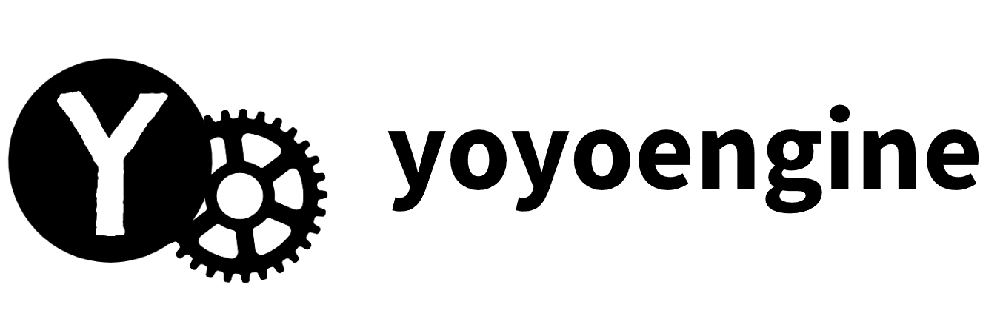

    <picture style="width: 100%; height: auto;">
        <source srcset=".github/media/lightheader.png"  media="(prefers-color-scheme: dark)">
        
    </picture>

---

A custom, hackable 2D Game Engine written in C.

Check out the hand-crafted documentation website **[here](https://zoogies.github.io/yoyoengine)**.

For advanced C developers, you can generate Doxygen documentation with `doxygen Doxyfile` in the `engine` directory.

#### Head on over to [the yoyoengine hub](https://github.com/yoyoengine/launcher) to download the latest editor release.

## What?

Yoyoengine started as a small game in SDL, and evolved into a fully featured, general purpose 2D game engine.

<table>
    <tr>
        <td></td>
        <td></td>
    </tr>
</table>

### Feature List:

- Easy to use visual editor
- Multi platform support (Windows, Linux, Web)
- Asset bundling by default, for optimized builds.
- A plugin system, with a few premade plugins for things like Discord RPC (see [yoyo-rpc](https://github.com/zoogies/yoyo-rpc))
- Generic Gamepad and Controller abstraction layer
- First class Lua scripting support, with native C scripting for complex or performance critical tasks

### Tech Stack:

- [SDL2](https://www.libsdl.org/) (windowing, rendering, audio, input, networking, etc)
- [Nuklear](https://github.com/Immediate-Mode-UI/Nuklear) (UI)
- [Uthash](https://github.com/troydhanson/uthash) (Hash tables)
- [Jansson](https://github.com/akheron/jansson) (JSON parsing)
- [Lua](https://www.lua.org/) (Scripting)
- Custom Entity Component System
- Custom binary packing format for assets, with [zlib](https://zlib.net/) for compression
- Custom physics and collision system

## Why?

In May 2023, I started working on a visual novel game in SDL2 as a way to learn C for the very first time. While I have yet to finish that game, the dopamine loop of working with a lower level language quickly spiraled me into a scope creep grind, and I ended up with a fully featured, general purpose game engine.

## Who?

### Zoogies.

I work on random projects of interest, and occasionally build games with this engine.

Feel free to check out my work on [GitHub](https://github.com/zoogies) or [Itch.io](https://zoogies.itch.io/).

You can get in touch with me through my [portfolio](https://zmuda.dev), on discord `@zoogies`, or by opening an issue on this repository. I don't usually check my email, but you can try that too.

## Credit

- The listed dependencies, for making this project possible.
- [Kaidiak](https://linktr.ee/kaidiak), for producing the engine splash screen sound effect.
- Ben Mathes, for creating icons used in the editor.
- The [SDL discord](https://discord.gg/BwpFGBWsv8), a must join community if you use SDL.
